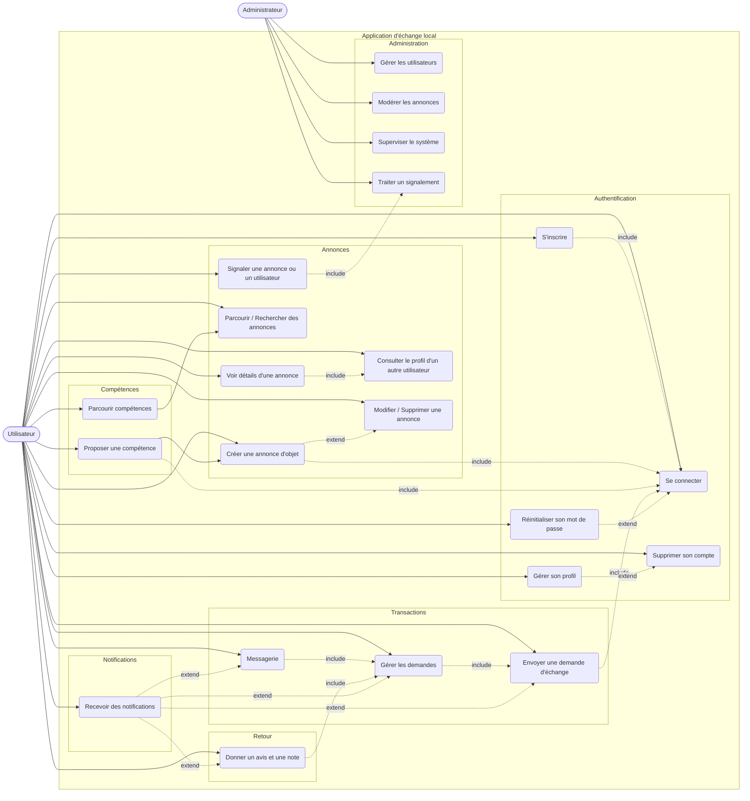

```mermaid
flowchart LR

actorUtilisateur([Utilisateur])
actorAdmin([Administrateur])

subgraph APP[Application d'échange local]

  subgraph AUTH[Authentification]
    UC_inscrire(S'inscrire)
    UC_connexion(Se connecter)
    UC_profil(Gérer son profil)
    UC_supprCompte(Supprimer son compte)
    UC_resetMdp(Réinitialiser son mot de passe)
  end

  subgraph ANNONCES[Annonces]
    UC_creerAnnonce(Créer une annonce d'objet)
    UC_parcourir(Parcourir / Rechercher des annonces)
    UC_details(Voir détails d'une annonce)
    UC_consulterProfil(Consulter le profil d'un autre utilisateur)
    UC_editAnnonce(Modifier / Supprimer une annonce)
    UC_signalement(Signaler une annonce ou un utilisateur)
  end

  subgraph COMPETENCES[Compétences]
    UC_competence(Proposer une compétence)
    UC_parcourirCompetences(Parcourir compétences)
  end

  subgraph TRANSACTIONS[Transactions]
    UC_envoyerDemande(Envoyer une demande d'échange)
    UC_gererDemandes(Gérer les demandes)
    UC_messagerie(Messagerie)
  end

  subgraph RETOUR[Retour]
    UC_avis(Donner un avis et une note)
  end

  subgraph NOTIFS[Notifications]
    UC_notifs(Recevoir des notifications)
  end

  subgraph ADMINISTRATION[Administration]
    UC_gererUsers(Gérer les utilisateurs)
    UC_moderer(Modérer les annonces)
    UC_superviser(Superviser le système)
    UC_traiterSignalement(Traiter un signalement)
  end
end

actorUtilisateur --> UC_inscrire
actorUtilisateur --> UC_connexion
actorUtilisateur --> UC_profil
actorUtilisateur --> UC_supprCompte
actorUtilisateur --> UC_resetMdp

actorUtilisateur --> UC_creerAnnonce
actorUtilisateur --> UC_parcourir
actorUtilisateur --> UC_details
actorUtilisateur --> UC_consulterProfil
actorUtilisateur --> UC_editAnnonce
actorUtilisateur --> UC_signalement

actorUtilisateur --> UC_competence
actorUtilisateur --> UC_parcourirCompetences

actorUtilisateur --> UC_envoyerDemande
actorUtilisateur --> UC_gererDemandes
actorUtilisateur --> UC_messagerie

actorUtilisateur --> UC_avis
actorUtilisateur --> UC_notifs

actorAdmin --> UC_gererUsers
actorAdmin --> UC_moderer
actorAdmin --> UC_superviser
actorAdmin --> UC_traiterSignalement

%% Relations include / extend
UC_inscrire -.->|include| UC_connexion
UC_creerAnnonce -.->|include| UC_connexion
UC_competence -.->|include| UC_connexion
UC_envoyerDemande -.->|include| UC_connexion
UC_gererDemandes -.->|include| UC_envoyerDemande
UC_messagerie -.->|include| UC_gererDemandes
UC_avis -.->|include| UC_gererDemandes
UC_notifs -.->|extend| UC_gererDemandes

UC_details -.->|include| UC_consulterProfil
UC_creerAnnonce -.->|extend| UC_editAnnonce

UC_competence --> UC_creerAnnonce
UC_parcourirCompetences --> UC_parcourir

UC_profil -.->|extend| UC_supprCompte

UC_signalement -.->|include| UC_traiterSignalement

UC_resetMdp -.->|extend| UC_connexion

UC_notifs -.->|extend| UC_envoyerDemande
UC_notifs -.->|extend| UC_messagerie
UC_notifs -.->|extend| UC_avis
```