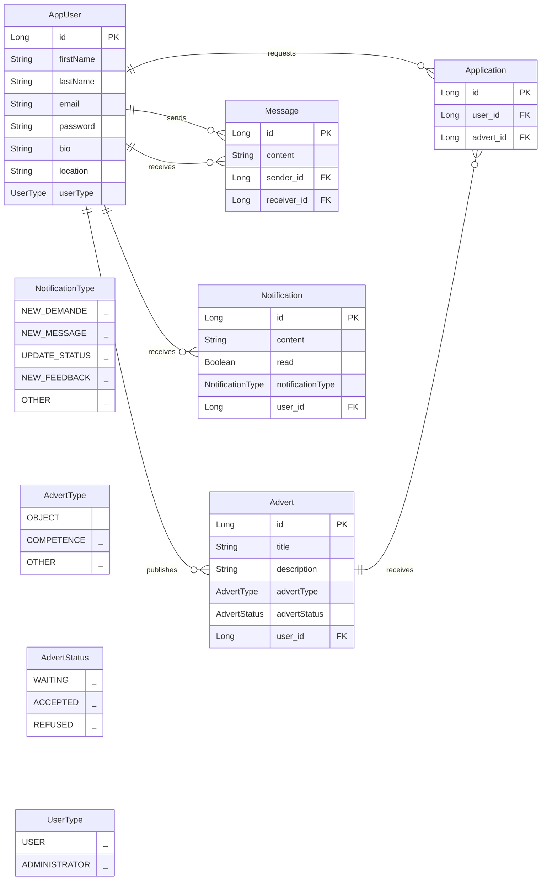

```mermaid
erDiagram
direction LR

    AppUser {
        Long id PK
        String firstName
        String lastName
        String email
        String password
        String bio
        String location
        UserType userType
    }

    Advert {
        Long id PK
        String title
        String description
        AdvertType advertType
        AdvertStatus advertStatus
        Long user_id FK
    }

    Application {
        Long id PK
        Long user_id FK
        Long advert_id FK
    }

    Message {
        Long id PK
        String content
        Long sender_id FK
        Long receiver_id FK
    }

    Notification {
        Long id PK
        String content
        Boolean read
        NotificationType notificationType
        Long user_id FK
    }

    NotificationType {
        NEW_DEMANDE _
        NEW_MESSAGE _
        UPDATE_STATUS _
        NEW_FEEDBACK _
        OTHER _
    }

    AdvertType {
        OBJECT _
        COMPETENCE _
        OTHER _
    }

    AdvertStatus {
        WAITING _
        ACCEPTED _
        REFUSED _
    }

    UserType {
        USER _
        ADMINISTRATOR _
    }

    AppUser ||--o{ Advert : publishes
    AppUser ||--o{ Application : requests
    Advert ||--o{ Application : receives
    AppUser ||--o{ Message : sends
    AppUser ||--o{ Message : receives
    AppUser ||--o{ Notification : receives

```
