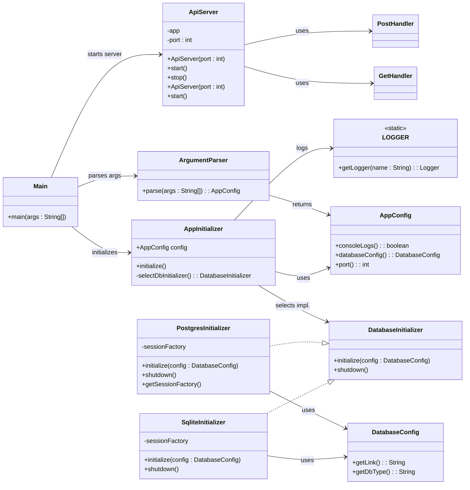

```mermaid

classDiagram
direction LR

    class Main {
        +main(args : String[])
    }

    class ApiServer {
        -app
        -port : int
        +ApiServer(port : int)
        +start()
        +stop()
    }

    class ArgumentParser {
        +parse(args : String[]) : AppConfig
    }

    class ApiServer {
        +ApiServer(port : int)
        +start()
    }

    class AppConfig {
        +consoleLogs() : boolean
        +databaseConfig() : DatabaseConfig
        +port() : int
    }

    class DatabaseConfig {
        +getLink() : String
        +getDbType() : String
    }

    class AppInitializer {
        +AppConfig config
        +initialize()
        -selectDbInitializer() : DatabaseInitializer
    }

    %% Logger statique
    class LOGGER {
        <<static>>
        +getLogger(name : String) : Logger
    }

    class DatabaseInitializer {
        +initialize(config : DatabaseConfig)
        +shutdown()
    }

    class PostgresInitializer {
        -sessionFactory
        +initialize(config : DatabaseConfig)
        +shutdown()
        +getSessionFactory()
    }

    class SqliteInitializer {
        -sessionFactory
        +initialize(config : DatabaseConfig)
        +shutdown()
    }

    Main --> ArgumentParser : parses args
    ArgumentParser --> AppConfig : returns
    Main --> AppInitializer : initializes
    Main --> ApiServer : starts server

    AppInitializer --> AppConfig : uses
    AppInitializer --> DatabaseInitializer : selects impl.
    AppInitializer --> LOGGER : logs

    PostgresInitializer ..|> DatabaseInitializer
    SqliteInitializer ..|> DatabaseInitializer

    PostgresInitializer --> DatabaseConfig : uses
    SqliteInitializer --> DatabaseConfig : uses

    ApiServer --> GetHandler : uses
    ApiServer --> PostHandler : uses

```
