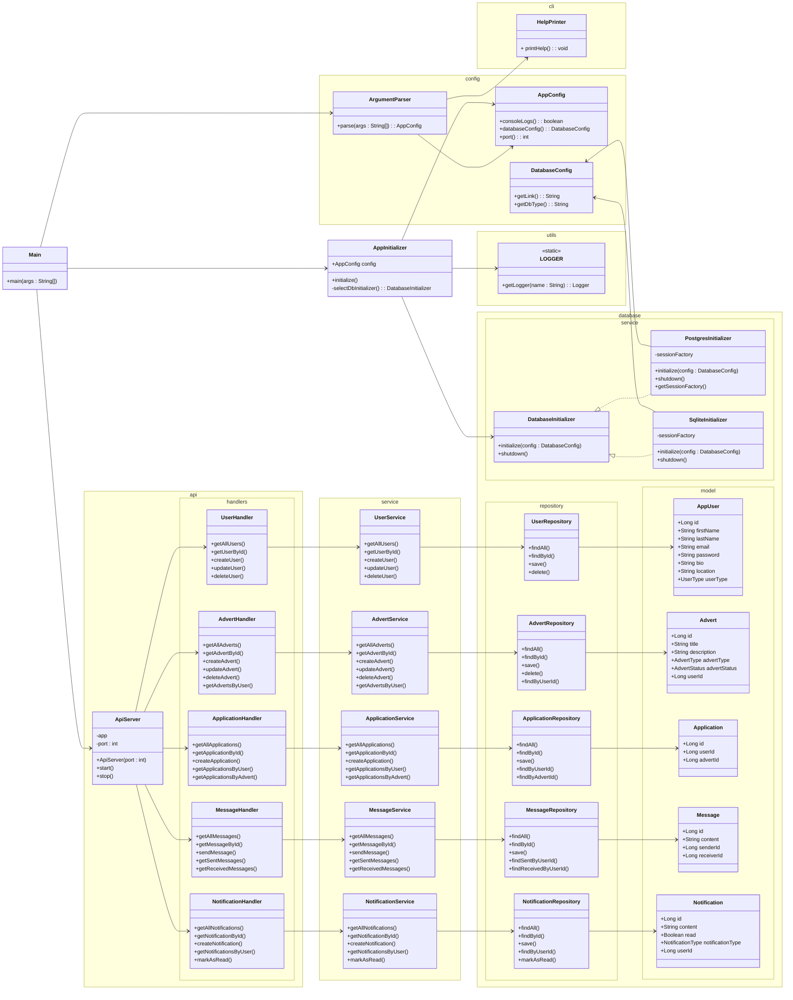

```mermaid
classDiagram
direction LR

class Main {
    +main(args : String[])
}

class AppInitializer {
    +AppConfig config
    +initialize()
    -selectDbInitializer() : DatabaseInitializer
}

namespace api {
    class ApiServer {
        -app
        -port : int
        +ApiServer(port : int)
        +start()
        +stop()
    }
}

namespace api.handlers {
    class UserHandler {
        +getAllUsers()
        +getUserById()
        +createUser()
        +updateUser()
        +deleteUser()
    }

    class AdvertHandler {
        +getAllAdverts()
        +getAdvertById()
        +createAdvert()
        +updateAdvert()
        +deleteAdvert()
        +getAdvertsByUser()
    }

    class ApplicationHandler {
        +getAllApplications()
        +getApplicationById()
        +createApplication()
        +getApplicationsByUser()
        +getApplicationsByAdvert()
    }

    class MessageHandler {
        +getAllMessages()
        +getMessageById()
        +sendMessage()
        +getSentMessages()
        +getReceivedMessages()
    }

    class NotificationHandler {
        +getAllNotifications()
        +getNotificationById()
        +createNotification()
        +getNotificationsByUser()
        +markAsRead()
    }
}

namespace cli {
    class HelpPrinter {
        + printHelp() : void
    }
}

namespace config {
    class ArgumentParser {
        +parse(args : String[]) : AppConfig
    }

    class AppConfig {
        +consoleLogs() : boolean
        +databaseConfig() : DatabaseConfig
        +port() : int
    }

    class DatabaseConfig {
        +getLink() : String
        +getDbType() : String
    }
}

namespace utils {
    class LOGGER {
        <<static>>
        +getLogger(name : String) : Logger
    }
}

namespace database.service {
    class DatabaseInitializer {
        +initialize(config : DatabaseConfig)
        +shutdown()
    }

    class PostgresInitializer {
        -sessionFactory
        +initialize(config : DatabaseConfig)
        +shutdown()
        +getSessionFactory()
    }

    class SqliteInitializer {
        -sessionFactory
        +initialize(config : DatabaseConfig)
        +shutdown()
    }
}

namespace database.model {
    class AppUser {
        +Long id
        +String firstName
        +String lastName
        +String email
        +String password
        +String bio
        +String location
        +UserType userType
    }

    class Advert {
        +Long id
        +String title
        +String description
        +AdvertType advertType
        +AdvertStatus advertStatus
        +Long userId
    }

    class Application {
        +Long id
        +Long userId
        +Long advertId
    }

    class Message {
        +Long id
        +String content
        +Long senderId
        +Long receiverId
    }

    class Notification {
        +Long id
        +String content
        +Boolean read
        +NotificationType notificationType
        +Long userId
    }
}

namespace database.repository {
    class UserRepository {
        +findAll()
        +findById()
        +save()
        +delete()
    }

    class AdvertRepository {
        +findAll()
        +findById()
        +save()
        +delete()
        +findByUserId()
    }

    class ApplicationRepository {
        +findAll()
        +findById()
        +save()
        +findByUserId()
        +findByAdvertId()
    }

    class MessageRepository {
        +findAll()
        +findById()
        +save()
        +findSentByUserId()
        +findReceivedByUserId()
    }

    class NotificationRepository {
        +findAll()
        +findById()
        +save()
        +findByUserId()
        +markAsRead()
    }
}

namespace service {
    class UserService {
        +getAllUsers()
        +getUserById()
        +createUser()
        +updateUser()
        +deleteUser()
    }

    class AdvertService {
        +getAllAdverts()
        +getAdvertById()
        +createAdvert()
        +updateAdvert()
        +deleteAdvert()
        +getAdvertsByUser()
    }

    class ApplicationService {
        +getAllApplications()
        +getApplicationById()
        +createApplication()
        +getApplicationsByUser()
        +getApplicationsByAdvert()
    }

    class MessageService {
        +getAllMessages()
        +getMessageById()
        +sendMessage()
        +getSentMessages()
        +getReceivedMessages()
    }

    class NotificationService {
        +getAllNotifications()
        +getNotificationById()
        +createNotification()
        +getNotificationsByUser()
        +markAsRead()
    }
}

Main --> ArgumentParser
ArgumentParser --> AppConfig
ArgumentParser --> HelpPrinter
Main --> AppInitializer
Main --> ApiServer

AppInitializer --> AppConfig
AppInitializer --> DatabaseInitializer
AppInitializer --> LOGGER

DatabaseInitializer <|.. PostgresInitializer
DatabaseInitializer <|.. SqliteInitializer

DatabaseConfig <-- PostgresInitializer
DatabaseConfig <-- SqliteInitializer

ApiServer --> UserHandler
ApiServer --> AdvertHandler
ApiServer --> ApplicationHandler
ApiServer --> NotificationHandler
ApiServer --> MessageHandler

UserHandler --> UserService
UserService --> UserRepository

AdvertHandler --> AdvertService
AdvertService --> AdvertRepository

ApplicationHandler --> ApplicationService
ApplicationService --> ApplicationRepository

MessageHandler --> MessageService
MessageService --> MessageRepository

NotificationHandler --> NotificationService
NotificationService --> NotificationRepository

UserRepository --> AppUser
AdvertRepository --> Advert
ApplicationRepository --> Application
MessageRepository --> Message
NotificationRepository --> Notification

```