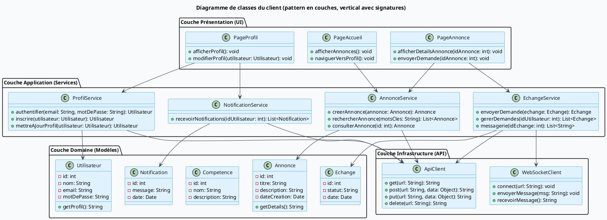

___
```plantuml@startuml
title Diagramme de classes du client (pattern en couches - simplifié)

top to bottom direction

skinparam backgroundColor #F9FAFB
skinparam defaultFontName Arial
skinparam defaultFontSize 13
skinparam class {
  BackgroundColor #E0F2FE
  BorderColor #0284C7
  ArrowColor #334155
  FontColor #0F172A
  FontStyle bold
}

' --- Couche Présentation (UI) ---
package "Couche Présentation (UI)" {
  class PageAccueil
  class PageAnnonce
  class PageProfil
}

' --- Couche Application (Services) ---
package "Couche Application (Services)" {
  class AnnonceService
  class ProfilService
  class EchangeService
  class NotificationService
}

' --- Couche Domaine (Modèles) ---
package "Couche Domaine (Modèles)" {
  class Utilisateur
  class Annonce
  class Competence
  class Echange
  class Notification
}

' --- Couche Infrastructure (API) ---
package "Couche Infrastructure (API)" {
  class ApiClient
  class WebSocketClient
}

' --- Relations entre couches ---
PageAccueil --> AnnonceService
PageAnnonce --> AnnonceService
PageAnnonce --> EchangeService
PageProfil --> ProfilService
PageProfil --> NotificationService

AnnonceService --> Annonce
ProfilService --> Utilisateur
EchangeService --> Echange
NotificationService --> Notification
EchangeService --> WebSocketClient

AnnonceService --> ApiClient
ProfilService --> ApiClient
EchangeService --> ApiClient
NotificationService --> ApiClient

@enduml
```

___
Version détaillé

