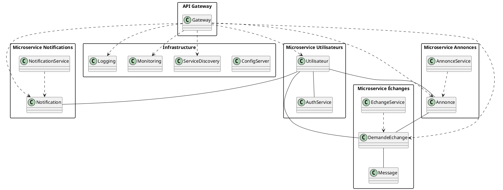
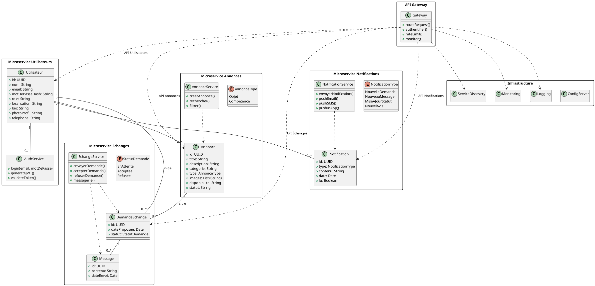

___

```plantuml
@startuml
skinparam packageStyle rectangle
skinparam componentStyle rectangle

' === API Gateway ===
package "API Gateway" {
  class Gateway
}

' === Microservice Utilisateurs ===
package "Microservice Utilisateurs" {
  class Utilisateur
  class AuthService
  Utilisateur -- AuthService
}

' === Microservice Annonces ===
package "Microservice Annonces" {
  class Annonce
  class AnnonceService
  Utilisateur -- Annonce
  AnnonceService ..> Annonce
}

' === Microservice Échanges ===
package "Microservice Échanges" {
  class DemandeEchange
  class Message
  class EchangeService
  Annonce -- DemandeEchange
  Utilisateur -- DemandeEchange
  DemandeEchange -- Message
  EchangeService ..> DemandeEchange
}

' === Microservice Notifications ===
package "Microservice Notifications" {
  class Notification
  class NotificationService
  Utilisateur -- Notification
  NotificationService ..> Notification
}

' === Infrastructure ===
package "Infrastructure" {
  class ConfigServer
  class ServiceDiscovery
  class Monitoring
  class Logging
}

' === Connexions entre microservices via Gateway ===
Gateway ..> Utilisateur
Gateway ..> Annonce
Gateway ..> DemandeEchange
Gateway ..> Notification

Gateway ..> ServiceDiscovery
Gateway ..> Monitoring
Gateway ..> Logging

@enduml
```

___

```plantuml
@startuml
skinparam packageStyle rectangle
skinparam componentStyle rectangle

' === API Gateway ===
package "API Gateway" {
  class Gateway {
    +routeRequest()
    +authentifier()
    +rateLimit()
    +monitor()
  }
}

' === Microservice Utilisateurs ===
package "Microservice Utilisateurs" {
  class Utilisateur {
    +id: UUID
    +nom: String
    +email: String
    +motDePasseHash: String
    +role: String
    +localisation: String
    +bio: String
    +photoProfil: String
    +telephone: String
  }

  class AuthService {
    +login(email, motDePasse)
    +generateJWT()
    +validateToken()
  }

  Utilisateur "1" -- "0..1" AuthService
}

' === Microservice Annonces ===
package "Microservice Annonces" {
  class Annonce {
    +id: UUID
    +titre: String
    +description: String
    +categorie: String
    +type: AnnonceType
    +images: List<String>
    +disponibilite: String
    +statut: String
  }

  enum AnnonceType {
    Objet
    Competence
  }

  class AnnonceService {
    +creerAnnonce()
    +rechercher()
    +filtrer()
  }

  Utilisateur "1" -- "0..*" Annonce
  AnnonceService ..> Annonce
}

' === Microservice Échanges ===
package "Microservice Échanges" {
  class DemandeEchange {
    +id: UUID
    +dateProposee: Date
    +statut: StatutDemande
  }

  enum StatutDemande {
    EnAttente
    Acceptee
    Refusee
  }

  class Message {
    +id: UUID
    +contenu: String
    +dateEnvoi: Date
  }

  class EchangeService {
    +envoyerDemande()
    +accepterDemande()
    +refuserDemande()
    +messagerie()
  }

  Annonce "1" -- "0..*" DemandeEchange : "cible"
  Utilisateur "1" -- "0..*" DemandeEchange : "initie"
  DemandeEchange "1" -- "0..*" Message
  EchangeService ..> DemandeEchange
  EchangeService ..> Message
}

' === Microservice Notifications ===
package "Microservice Notifications" {
  class Notification {
    +id: UUID
    +type: NotificationType
    +contenu: String
    +date: Date
    +lu: Boolean
  }

  enum NotificationType {
    NouvelleDemande
    NouveauMessage
    MiseAJourStatut
    NouvelAvis
  }

  class NotificationService {
    +envoyerNotification()
    +pushEmail()
    +pushSMS()
    +pushInApp()
  }

  Utilisateur "1" -- "0..*" Notification
  NotificationService ..> Notification
}

' === Infrastructure transversale ===
package "Infrastructure" {
  class ConfigServer
  class ServiceDiscovery
  class Monitoring
  class Logging

  Gateway ..> ServiceDiscovery
  Gateway ..> Monitoring
  Gateway ..> Logging
}

' === Connexions entre microservices via Gateway ===
Gateway ..> Utilisateur : "API Utilisateurs"
Gateway ..> Annonce : "API Annonces"
Gateway ..> DemandeEchange : "API Échanges"
Gateway ..> Notification : "API Notifications"

@enduml
```

___
