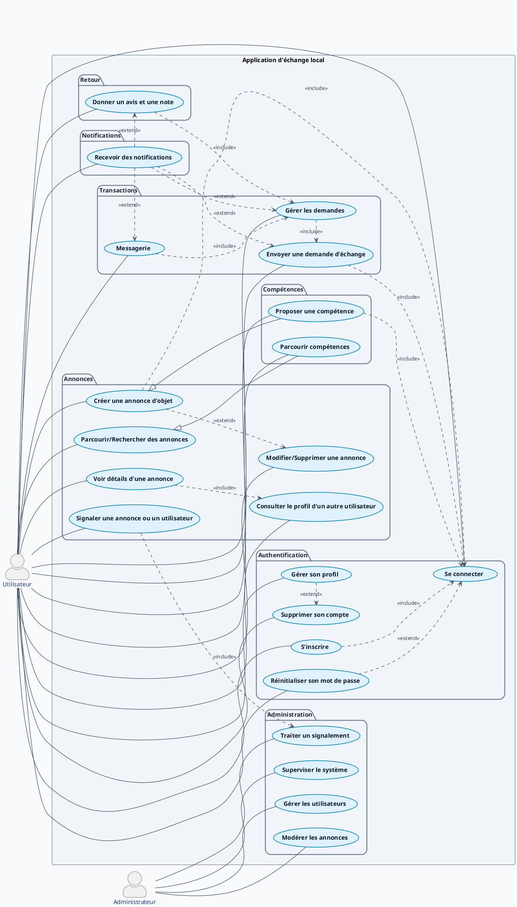

---

```plantuml
@startuml
left to right direction

skinparam backgroundColor #F9FAFB
skinparam defaultFontName Arial
skinparam defaultFontSize 14

skinparam actorStyle awesome
skinparam actor {
  FontColor #1E3A8A
  FontSize 14
}

skinparam usecase {
  BackgroundColor #E0F2FE
  BorderColor #0284C7
  BorderThickness 1.5
  RoundCorner 20
  FontColor #0F172A
  FontStyle bold
}

skinparam package {
  BackgroundColor #F1F5F9
  BorderColor #64748B
  FontColor #1E293B
  FontSize 14
  FontStyle bold
  BorderThickness 2
  RoundCorner 25
  Padding 15
}

skinparam Arrow {
  Color #475569
  Thickness 1.2
  FontColor #334155
  FontSize 12
}

actor Utilisateur
actor "Administrateur" as Admin

rectangle "Application d'échange local" {
  
  package "Authentification" {
    Utilisateur -- (S'inscrire)
    Utilisateur -- (Se connecter)
    Utilisateur -- (Gérer son profil)
    Utilisateur -- (Supprimer son compte)
    Utilisateur -- (Réinitialiser son mot de passe)
  }

  package "Annonces" {
    Utilisateur -- (Créer une annonce d'objet)
    Utilisateur -- (Parcourir/Rechercher des annonces)
    Utilisateur -- (Voir détails d'une annonce)
    Utilisateur -- (Consulter le profil d'un autre utilisateur)
    Utilisateur -- (Modifier/Supprimer une annonce)
    Utilisateur -- (Signaler une annonce ou un utilisateur)
  }

  package "Compétences" {
    Utilisateur -- (Proposer une compétence)
    Utilisateur -- (Parcourir compétences)
  }

  package "Transactions" {
    Utilisateur -- (Envoyer une demande d'échange)
    Utilisateur -- (Gérer les demandes)
    Utilisateur -- (Messagerie)
  }

  package "Retour" {
    Utilisateur -- (Donner un avis et une note)
  }

  package "Notifications" {
    Utilisateur -- (Recevoir des notifications)
  }

  package "Administration" {
    Admin -- (Gérer les utilisateurs)
    Admin -- (Modérer les annonces)
    Admin -- (Superviser le système)
    Admin -- (Traiter un signalement)
  }
}

  (S'inscrire) ..> (Se connecter) : <<include>>
  (Créer une annonce d'objet) ..> (Se connecter) : <<include>>
  (Proposer une compétence) ..> (Se connecter) : <<include>>
  (Envoyer une demande d'échange) ..> (Se connecter) : <<include>>
  (Gérer les demandes) .> (Envoyer une demande d'échange) : <<include>>
  (Messagerie) ..> (Gérer les demandes) : <<include>>
  (Donner un avis et une note) ..> (Gérer les demandes) : <<include>>
  (Recevoir des notifications) ..> (Gérer les demandes) : <<extend>>
  (Voir détails d'une annonce) ..> (Consulter le profil d'un autre utilisateur) : <<include>>
  (Créer une annonce d'objet) ..> (Modifier/Supprimer une annonce) : <<extend>>
  (Créer une annonce d'objet) <|-- (Proposer une compétence)
  (Parcourir/Rechercher des annonces) <|-- (Parcourir compétences)
  (Gérer son profil) .> (Supprimer son compte) : <<extend>>
  (Signaler une annonce ou un utilisateur) ..> (Traiter un signalement) : <<include>>
  (Réinitialiser son mot de passe) ..> (Se connecter) : <<extend>>
  (Recevoir des notifications) .> (Envoyer une demande d'échange) : <<extend>>
  (Recevoir des notifications) .> (Messagerie) : <<extend>>
  (Recevoir des notifications) .> (Donner un avis et une note) : <<extend>>


@enduml
```

---
