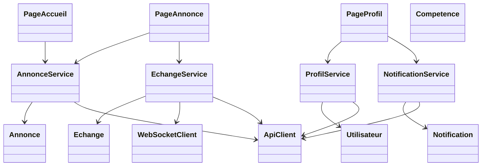

___

```mermaid
classDiagram
direction TB

%% --- Couche Présentation ---
subgraph Couche_Presentation_UI
    class PageAccueil
    class PageAnnonce
    class PageProfil
end

%% --- Couche Application ---
subgraph Couche_Application_Services
    class AnnonceService
    class ProfilService
    class EchangeService
    class NotificationService
end

%% --- Couche Domaine ---
subgraph Couche_Domaine_Modeles
    class Utilisateur
    class Annonce
    class Competence
    class Echange
    class Notification
end

%% --- Couche Infrastructure ---
subgraph Couche_Infrastructure_API
    class ApiClient
    class WebSocketClient
end

%% Relations UI → Services
PageAccueil --> AnnonceService
PageAnnonce --> AnnonceService
PageAnnonce --> EchangeService
PageProfil --> ProfilService
PageProfil --> NotificationService

%% Services → Domain
AnnonceService --> Annonce
ProfilService --> Utilisateur
EchangeService --> Echange
NotificationService --> Notification

%% Services → Infrastructure
EchangeService --> WebSocketClient
AnnonceService --> ApiClient
ProfilService --> ApiClient
EchangeService --> ApiClient
NotificationService --> ApiClient

```

___
Version détaillé

```mermaid

classDiagram
direction TB

%% --- Couche Présentation ---
subgraph Couche_Presentation_UI
    class PageAccueil
    class PageAnnonce
    class PageProfil
end

%% --- Couche Application ---
subgraph Couche_Application_Services
    class AnnonceService
    class ProfilService
    class EchangeService
    class NotificationService
end

%% --- Couche Domaine ---
subgraph Couche_Domaine_Modeles
    class Utilisateur
    class Annonce
    class Competence
    class Echange
    class Notification
end

%% --- Couche Infrastructure ---
subgraph Couche_Infrastructure_API
    class ApiClient
    class WebSocketClient
end

%% Relations UI → Services
PageAccueil --> AnnonceService
PageAnnonce --> AnnonceService
PageAnnonce --> EchangeService
PageProfil --> ProfilService
PageProfil --> NotificationService

%% Services → Domain
AnnonceService --> Annonce
ProfilService --> Utilisateur
EchangeService --> Echange
NotificationService --> Notification

%% Services → Infrastructure
EchangeService --> WebSocketClient
AnnonceService --> ApiClient
ProfilService --> ApiClient
EchangeService --> ApiClient
NotificationService --> ApiClient

```