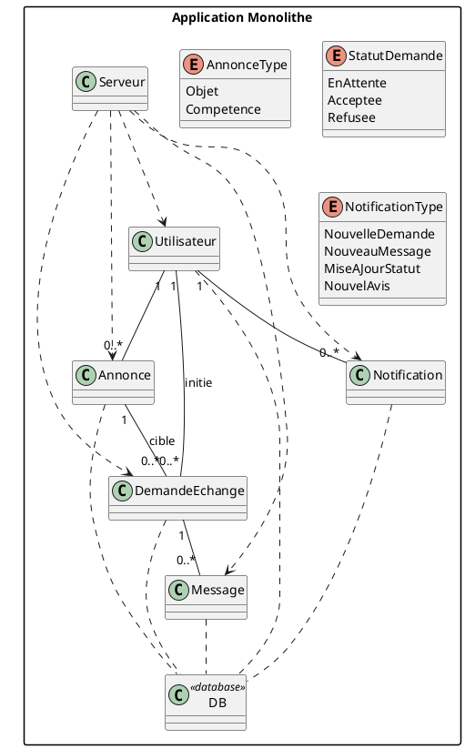
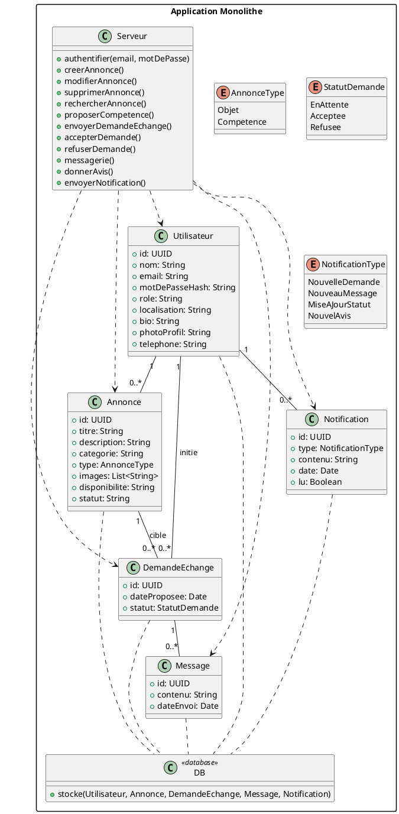

___

```plantuml
@startuml
skinparam packageStyle rectangle
skinparam componentStyle rectangle

package "Application Monolithe" {

  class Serveur {
  }

  class Utilisateur {
  }

  class Annonce {
  }

  enum AnnonceType {
    Objet
    Competence
  }

  class DemandeEchange {
  }

  enum StatutDemande {
    EnAttente
    Acceptee
    Refusee
  }

  class Message {
  }

  class Notification {
  }

  enum NotificationType {
    NouvelleDemande
    NouveauMessage
    MiseAJourStatut
    NouvelAvis
  }

  class DB <<database>> {
  }

  Utilisateur "1" -- "0..*" Annonce
  Annonce "1" -- "0..*" DemandeEchange : "cible"
  Utilisateur "1" -- "0..*" DemandeEchange : "initie"
  DemandeEchange "1" -- "0..*" Message
  Utilisateur "1" -- "0..*" Notification

  Serveur ..> Utilisateur
  Serveur ..> Annonce
  Serveur ..> DemandeEchange
  Serveur ..> Message
  Serveur ..> Notification

  Utilisateur .. DB
  Annonce .. DB
  DemandeEchange .. DB
  Message .. DB
  Notification .. DB
}

@enduml

```

___

```plantuml
@startuml
skinparam packageStyle rectangle
skinparam componentStyle rectangle

package "Application Monolithe" {

  class Serveur {
    +authentifier(email, motDePasse)
    +creerAnnonce()
    +modifierAnnonce()
    +supprimerAnnonce()
    +rechercherAnnonce()
    +proposerCompetence()
    +envoyerDemandeEchange()
    +accepterDemande()
    +refuserDemande()
    +messagerie()
    +donnerAvis()
    +envoyerNotification()
  }

  class Utilisateur {
    +id: UUID
    +nom: String
    +email: String
    +motDePasseHash: String
    +role: String
    +localisation: String
    +bio: String
    +photoProfil: String
    +telephone: String
  }

  class Annonce {
    +id: UUID
    +titre: String
    +description: String
    +categorie: String
    +type: AnnonceType
    +images: List<String>
    +disponibilite: String
    +statut: String
  }

  enum AnnonceType {
    Objet
    Competence
  }

  class DemandeEchange {
    +id: UUID
    +dateProposee: Date
    +statut: StatutDemande
  }

  enum StatutDemande {
    EnAttente
    Acceptee
    Refusee
  }

  class Message {
    +id: UUID
    +contenu: String
    +dateEnvoi: Date
  }

  class Notification {
    +id: UUID
    +type: NotificationType
    +contenu: String
    +date: Date
    +lu: Boolean
  }

  enum NotificationType {
    NouvelleDemande
    NouveauMessage
    MiseAJourStatut
    NouvelAvis
  }

  class DB <<database>> {
    +stocke(Utilisateur, Annonce, DemandeEchange, Message, Notification)
  }

  Utilisateur "1" -- "0..*" Annonce
  Annonce "1" -- "0..*" DemandeEchange : "cible"
  Utilisateur "1" -- "0..*" DemandeEchange : "initie"
  DemandeEchange "1" -- "0..*" Message
  Utilisateur "1" -- "0..*" Notification

  Serveur ..> Utilisateur
  Serveur ..> Annonce
  Serveur ..> DemandeEchange
  Serveur ..> Message
  Serveur ..> Notification

  Utilisateur .. DB
  Annonce .. DB
  DemandeEchange .. DB
  Message .. DB
  Notification .. DB
}
@enduml
```

___
